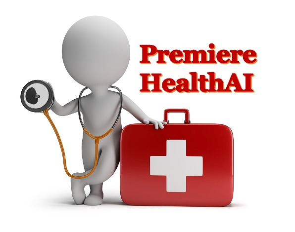
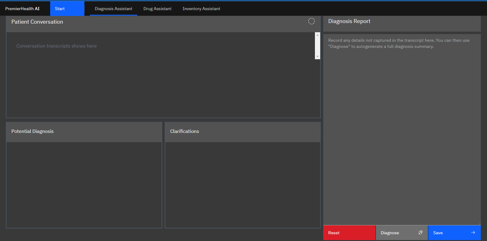
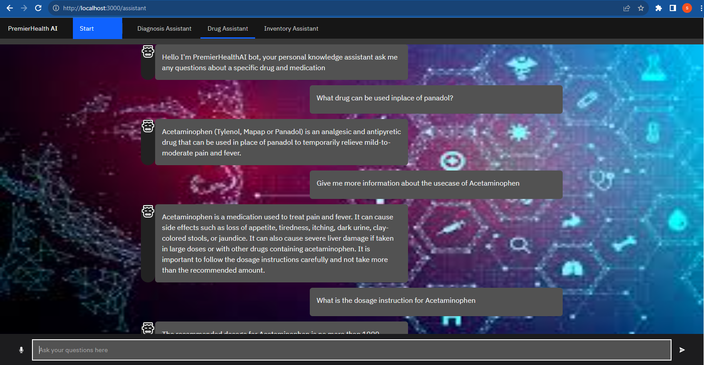
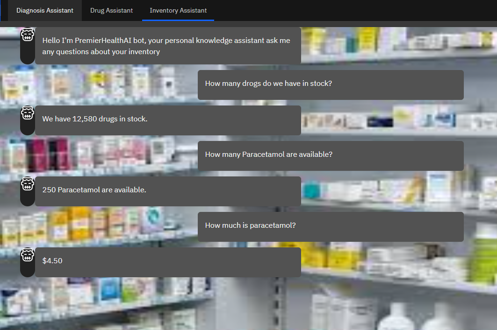
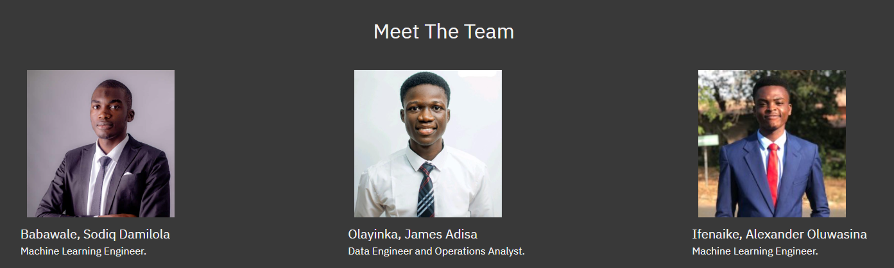

<p  align="center">



</p> 

# Project Title : PremierHealthAI

In the dynamic world of pharmacy, our cutting-edge AI solution revolutionizes the way pharmacists work. By automating tasks like inventory management and prescription processing, we empower pharmacists to focus on patient care. Our innovation reduces their administrative burden. Join us in this new era of pharmaceutical excellence, where technology simplifies work and elevates patient care.

## PremierHealthAI tackles these issues with a suite of advanced tools:

1. **Diagnosis Assistance**: Our AI solution is your trusted partner in accurate and efficient diagnosis. It assists pharmacists by providing real-time insights and information, enabling them to make well-informed decisions and offer the best care to their patients.
<p  align="center">



</p> 

2. **Comprehensive Drug Information**: Access to up-to-date information about drugs is now at your fingertips. Our AI platform empowers pharmacists with a vast database of drug details, including usage guidelines, interactions, side effects, and more, ensuring that you have the most current and reliable information available.
<p  align="center">



</p> 

3. **Inventory Management**: Say goodbye to inventory management hassles. Our AI system simplifies and streamlines the entire process, allowing you to optimize stock levels, reduce wastage, and ensure that essential medications are always available to serve your patients.
<p  align="center">



</p> 

## Tools & Technologies used:

1. **[OpenAI (GPT 3.5)](https://openai.com/)**: OpenAI, a powerful AI tool, is a key component of our solution, enabling advanced natural language processing and machine learning capabilities to enhance the functionality and intelligence of our system.

2.  **[Whisper](https://openai.com/blog/introducing-chatgpt-and-whisper-apis)** "Whisper, an integral tool in our solution, provides cutting-edge speech recognition capabilities, allowing for seamless voice-based interactions and enhancing the accessibility and convenience of our system."

3.  **[Langchain](https://langchain.readthedocs.io/en/latest/getting_started/getting_started.html)**: It is an open source library that provides abstractions for building LLM-based applications

4.  **[Svelte](https://svelte.dev/)**: The frontend of the application is built using swelvte.

5.  **[Socket.io](https://svelte.dev/)**: The frontend of the application is built using swelvte.


## Project Structure

    ├── LICENSE
    ├── README.md 
    ├── frontend 
    ├── server       
    ├── database
    └── imgs


## Getting Started

These instructions will help you get a copy of the project up and running on your local machine.

### Installing

1. Clone the repository:

```
    git clone https://github.com/Sodiq179/PremierHealthAI.git
```

2. Change directory to the project root:

```
    cd PremierHealthAI
```

**Front End**

1. Change directory to the frontend:

```
    cd frontend
```

2. Install the required node libraries:

```
   npm install
```

3. Run the frontend

```
    npm run dev -- --open
```

**Server**

1. Change directory to the server:

```
    cd server
```

2. Install the required libraries:

```
    pip install -r requirements.txt
```

3. Run the app

```
    python main.py
```


## References:

- [Langchain Question-Answering guide](https://langchain.readthedocs.io/en/latest/use_cases/question_answering.html)


## Acknowledgements:


## Meet the Team:
<p  align="center">



</p> 